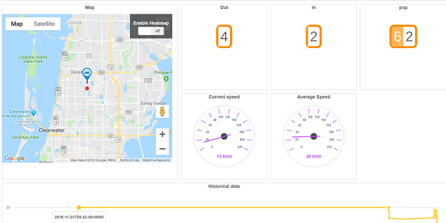

# eurotech_simpleapp

This is a simple demo app that demonstrates how easy it is to leverage data published by eurotech devices into scriptr.

## What the application does

The application is based on the Eurotech [PCN-Transport simulator](https://cs.eurotech.com/gps-pcn-simulator/). The simulator mimics the behavior of a device installed on a bus, which publishes data to a eurotech Everyware mqtt topic. Two types of events are published by the simulator:
- location and speed data, published while the bus is moving
- bus load data (passengers getting off, getting on, current number of passengers), published while the bus is stopped.

On the scriptr side, the application is subscribed to the Everyware mqtt topic. As soon as events arrive, they are are persisted in the scriptr's data store and further published to a simple dashboard that is updated in real time. The dahboard displays real time data and historical data:
- real time data: the location of the bus on a map as well as latest values of speed, passengers in, passengers out, current number of passengers and average speed.
- historical data: evolution of in, out and number of passengers with time

*Image 1 - The application's dashboard*

## Pre-requisites

You need an account in the following:

- [Everyware account](https://console-sandbox.everyware-cloud.com/) (sandbox in this example) and you need to create an mqtt topic in the platform to which the simulator will publish data
- [scriptr account](https://www.scriptr.io/login)
- [Github](https://github.com/login) {the Github account won't be heavily used by is required to simpl

# Installing the application

## Import from Github

From your [scriptr workspace](https://www.scriptr.io/workspace), click on the arrow next to +New Script in the bottom left corner of the screen:
- Click on **Install Modules**
- In the Modules dialog:
  - Expand +Add Custom Module from GitHub 
  - Use scriptrdotio as account owner
  - Use eurotech_simpleapp as Repository name
  - Leave the path empty
  - Use /eurotech_simpleapp as destination folder
  - Click Install when done
  
 

*Image 2 - Import the application from Github to scriptr*

## Configure the application

### Create channels

Channels are used by scriptr as abstraction of publish/subscribe mechanisms. We will create two channels:
- The **eurotech** channel will be used to convey any message received on the Everyware topic we are subscribed to, to our application
- The **responseChannel** channel will be used to publish data to our dashboard in real-time

From your [scriptr workspace](https://www.scriptr.io/workspace), click on your username in the top right corner of the screen:
- Click on Settings then select the **Channels** tab
- In the dialog, expand +Add Channel
- Enter a name for your channel (eurotech)
- Click on the checkbox to the right to validate

Proceed similarly to create the second channel (responseChannel) but this time

*Image 3 - Create your channels*

### Subscribe to the Everyware MQTT topic

Data are published in two distinct topics hosted by the Everyware platform

- {account}/{client_id}/PCNPublisher/LocationPublisher/location. Published data are position_speed, position_longitude, position_latitude
- {account}/{client_id}/PCNPublisher/Bus. Published data are position_longitude, position_latitude, AbsolutePop, AbsoluteOut, AbsoluteIn 

You need to create an endpoint + bridge on scriptr to subscribe to the above. On that purpose, you will use the following configuration:

- URL: mqtt://broker-sandbox.everyware-cloud.com
- Port: 1883
- Username: *your Everyware username*
- Password: *your Everyware password*
- Topic: *your_everyware_topic*/+/#
