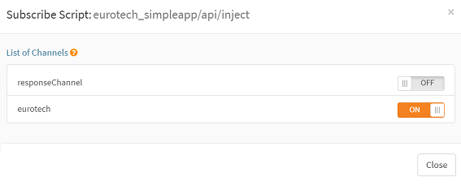

# Installing the application

## Configure Github in your scriptr account

To proceed with the installation steps, you need to own a Github account and a Github Personal Access Token. If you don' t have any of them, you can use the below temporarily:

- Github account username: scriptrdemoaccount
- Personal Access Token: a8eb34a42d29e37d334c66735986b364e918eedd

To configure the Github settings in scriptr, open your [scriptr workspace](https://www.scriptr.io/workspace), click on your username in the top right corner of the screen, then select **Settings** then click on the **Github** tab. 

Fill the fields as follows:
- Repository Owner: scriprdotio
- Access Token: your personal access token or the one provided above 
- Repository Name: demo
- Branch: master
- Path: leave empty

Click "Save" to validate you changes.

## Import the source code from Github

From your [scriptr workspace](https://www.scriptr.io/workspace), click on the arrow next to +New Script in the bottom left corner of the screen:
- Click on **Install Modules**
- In the Modules dialog:
  - Expand **+Add Custom Module from GitHub** 
  - Use scriptrdotio as account owner
  - Use eurotech_simpleapp as Repository name
  - Leave the path empty
  - Use /eurotech_simpleapp as destination folder
  - Click Install when done
  
 

*Image 1 - Import the application from Github to scriptr*

## Configure the application

```Diff
The below steps are provided for your information. 
You can skip them by running the **/installer/install** script that ships with the application. 
Before running this script though, make sure to onfigure the /installer/config script 
to reflect your own settings.
``` 

### Create a sub-domain for your scriptr account

From your [scriptr workspace](https://www.scriptr.io/workspace), click on your username then select **Account**
- Select the **Sub-domain** tab
- Enter a name for your sub-domain (it has to be unique, scriptr will reject names that already exist)
- click on close

 

*Image 2 - Create a scriptr sub-domain for your account*

### Create channels

Channels are used by scriptr as abstractions of publish/subscribe mechanisms. We will create two channels:
- The **eurotech** channel will be used to convey any message received on the Everyware topic we are subscribed to, to our application
- The **responseChannel** channel will be used to publish data to our dashboard in real-time

From your [scriptr workspace](https://www.scriptr.io/workspace), click on your username in the top right corner of the screen:
- Click on Settings then select the **Channels** tab
- In the dialog, expand +Add Channel
- Enter a name for your channel (eurotech)
- Click on the checkbox to the right to validate

Proceed similarly to create the second channel (responseChannel) but this time, check the **Allow anonymous subscription**


*Image 3 - Create your channels*

### Create a device

You need to create a device in scriptr that is the representation of the physical device in scriptr. Therefore, from the [scriptr workspace](https://www.scriptr.io/workspace):

- Click on your username in the top right corner of the screen
- Click on **Device directory**
- Click **+Add Device**
- Enter the same value for the id and name fields. **Make sure that they match the id of a device you've created using the [Eurotech simulator](https://cs.eurotech.com/gps-pcn-simulator/)** or an actual device id in your Everyware account
- Enter some password, then click on the checkbox to save your changes
- **Copy the authentication token that is associated to the device, as you will need it in the [create a bridge](./installing_the_application.md#create-a-bridge) step**


*Image 4 - Create a device*

### Subscribe to the Everyware MQTT topic

The devices used in this application publish data to two distinct topics hosted by the Everyware platform:

- {account}/{client_id}/PCNPublisher/LocationPublisher/location. Published data are position_speed, position_longitude, position_latitude
- {account}/{client_id}/PCNPublisher/Bus. Published data are position_longitude, position_latitude, AbsolutePop, AbsoluteOut, AbsoluteIn 

To automatically convey these messages to your scriptr account, you need to create an endpoint + bridge on scriptr that subscribe to the above. 

#### Create an endpoint 

From the [scriptr workspace](https://www.scriptr.io/workspace):

- Click on your username in the top right corner of the screen:
- Click on Settings then select the **External Endpoints** tab
- Click on **+Add External Endpoint**
- From the **Type** drop-down field, scroll to select **Eurotech**
- Set the value of the **URL** field to that of your Everyware account (e.g. mqtt://broker-sandbox.everyware-cloud.com)
- Set the **Port** field to 1883
- Set the **Username** to *your Everyware username*
- Set the **Password** to *your Everyware password*
- Set the **Topic** to *your_everyware_topic*/+/#
- Click on the checkbox button to validate your changes

#### Create a bridge

A bridge connects an endpoint to one of your scriptr channels. Thus to create a bridge, you need to choose a channel:

- Click on your username in the top right corner of the screen
- Click on **Settings** then select the **Channels** tab
- Click on the globe icon near the **eurotech** channel
- From the drop down list, select the **eurotech** endpoint
- Paste your device authentication token (obtained in [create a device](./installing_the_application.md#create-a-device))
- Click on **Add Bridge** to deploy a new bridge

### Subscribe the inject script to the eurotech channel

The above configuration subscribes your scriptr account to your mqtt topic on Everyware. All messages that are published to the latter will automatically be received by your **eurotech** channel. In order to start working on the payload contained in these messages, you just need to subscribe a script to the **eurotech** channel:

- Open the **/eurotech_simpleapp/api/inject** script by expanding the code tree on the left of your [workspace](https://www.scriptr.io/workspace)
- In the tool bar click on **Subscribe**
- In the channels list, switch the toggle on for **eurotech**
- Click on Close



*Image 5 - Susbcribe to the eurotech channel*

---

**[<< back](../README.md)**, **[next >>](./running_the_application.md)** 
