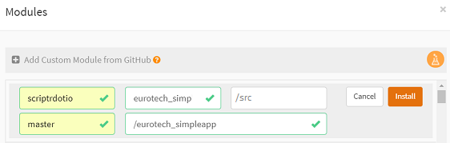

# Installing the application

## Import from Github

From your [scriptr workspace](https://www.scriptr.io/workspace), click on the arrow next to +New Script in the bottom left corner of the screen:
- Click on **Install Modules**
- In the Modules dialog:
  - Expand +Add Custom Module from GitHub 
  - Use scriptrdotio as account owner
  - Use eurotech_simpleapp as Repository name
  - Leave the path empty
  - Use /eurotech_simpleapp as destination folder
  - Click Install when done
  
 

*Image 1 - Import the application from Github to scriptr*

## Configure the application

### Create a sub-domain for your scriptr account

From your [scriptr workspace](https://www.scriptr.io/workspace), click on your username then select **Account**
- Select the **Sub-domain** tab
- Enter a name for your sub-domain (it has to be unique, scriptr will reject names that already exist)
- click on close

### Create channels

Channels are used by scriptr as abstractions of publish/subscribe mechanisms. We will create two channels:
- The **eurotech** channel will be used to convey any message received on the Everyware topic we are subscribed to, to our application
- The **responseChannel** channel will be used to publish data to our dashboard in real-time

From your [scriptr workspace](https://www.scriptr.io/workspace), click on your username in the top right corner of the screen:
- Click on Settings then select the **Channels** tab
- In the dialog, expand +Add Channel
- Enter a name for your channel (eurotech)
- Click on the checkbox to the right to validate

Proceed similarly to create the second channel (responseChannel) but this time, check the **Allow anonymous subscription**

*Image 2 - Create your channels*

### Subscribe to the Everyware MQTT topic

Data are published in two distinct topics hosted by the Everyware platform

- {account}/{client_id}/PCNPublisher/LocationPublisher/location. Published data are position_speed, position_longitude, position_latitude
- {account}/{client_id}/PCNPublisher/Bus. Published data are position_longitude, position_latitude, AbsolutePop, AbsoluteOut, AbsoluteIn 

You need to create an endpoint + bridge on scriptr to subscribe to the above. On that purpose, you will use the following configuration:

- URL: mqtt://broker-sandbox.everyware-cloud.com
- Port: 1883
- Username: *your Everyware username*
- Password: *your Everyware password*
- Topic: *your_everyware_topic*/+/#

### Subscribe the inject script to the eurotech channel

The above configuration subscribes your scriptr account to your mqtt topic on Everyware. All messages that are published to the latter will automatically be received by your **eurotech** channel. In order to start working on the payload contained in these messages, you just need to subscribe a script to the **eurotech** channel:

- Open the **/eurotech_simpleapp/api/inject** script by expanding the code tree on the left of your [workspace](https://www.scriptr.io/workspace)
- In the tool bar click on **Subscribe**
- In the channels list, switch the toggle on for **eurotech**
- Click on Close

*Image 3 - Susbcribe to the eurotech channel*

---

**[<< back](./README.md)**, **[next >>]()** 
