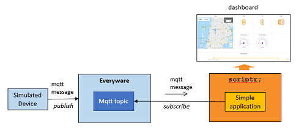

# Overview

## Description

This a simple dashboard application that monitors metrics sent by devices installed on buses. As you can read it in [running the application](./running_the_application.md), you can simulate the device by resorting to Eurotech's simulator mimics. The latter publishes data to a eurotech Everyware mqtt topic. Two types of events are published by the simulator:
- location and speed data, published while the bus is moving
- bus load data (passengers getting off, getting on, current number of passengers), published while the bus is stopped.

On the scriptr side, the application is subscribed to the Everyware mqtt topic. As soon as events arrive, they are are persisted in the scriptr's data store and further published to a simple dashboard that is updated in real time. 

*Image 1 - Architecture overview*

The dashboard displays real time data and historical data:
- real time data: the location of the bus on a map as well as latest values of speed, passengers in, passengers out, current number of passengers and average speed.
- historical data: evolution of in, out and number of passengers with time

*Image 2 - The application's dashboard*

## Pre-requisites

You need an account in the following:

- [Everyware account](https://console-sandbox.everyware-cloud.com/) (sandbox in this example) and you need to create an mqtt topic in the platform to which the simulator will publish data
- [scriptr account](https://www.scriptr.io/login)

---
**[<< back](../README.md)**, **[next >>](./installing_the_application.md)**
