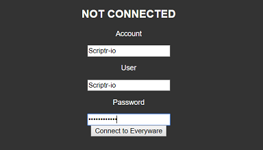
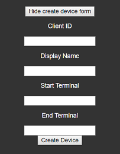
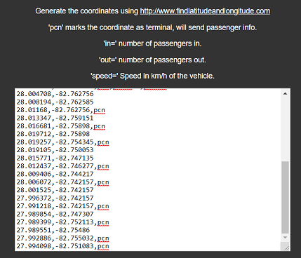
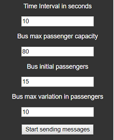

# Running the application

## Generate device data using Eurotech's simulator

To start generating data using Eurotech's PCN transport simulator, follow the steps described in [Eurotech's documentation](https://github.com/eurotech/pcn-trans-demo/blob/master/docs/web-pcn-sim.md), which we reproduce in the following:

- Sign-in to the [simulator](https://cs.eurotech.com/gps-pcn-simulator/) **using your Everyware credentials** (account name, username and password). Make sure to use the credentials of an Everywhere user who is authorized to publish to the mqtt topics of the platform



*Image 1 - Sign-in to Eurotech PCN transport simulator*

- Click on **create device** to create a new simulated device
- Fill the form by entering any name for the device and start and end terminals (bus stations) 
- Click on **Create device**



*Image 2 - Create a device*

- Enter some data for the simulator. Best option is to copy/paste the [data below](https://github.com/scriptrdotio/eurotech_simpleapp/blob/master/documentation/running_the_application.md#data) (obtained from  [Eurotech's documentation](https://github.com/eurotech/pcn-trans-demo/blob/master/docs/web-pcn-sim.md))



*Image 3 - Enter some data for the simulator*

- If you wish, configure the frequency at which messages will be published to Everywhere, as well as the max number of passenger, etc.
- Once ready, click on **Start sending messages**



*Image 4 - Send messages*

## Open the dashboard in the browser

- From your [scriptr workspace](https://www.scriptr.io/workspace), expand the code tree on your left and open the **/eurotech_simpleapp/view/dashboard** script
- Click on **View** in the toolbar to open the dashboard in the browser

---
**[<< back](../README.md)**, **[next >>]()** 

# Data
```
27.986519,-82.733574,pcn
27.961201,-82.762928
27.938304,-82.746792
27.938304,-82.750397,pcn,paxin=2,paxout=1
27.938304,-82.75692
27.938304,-82.762585
27.943612,-82.763271,pcn,paxin=1,paxout=2
27.948919,-82.7631
27.954378,-82.762756
27.959837,-82.762413,pcn
27.96393,-82.762756
27.967418,-82.7631
27.972269,-82.763443,pcn
27.977878,-82.763443
27.984852,-82.763443,pcn
27.991825,-82.763443,pcn
27.997433,-82.763443
28.001374,-82.762928,pcn,paxin=5,paxout=1
28.004708,-82.762756
28.008194,-82.762585
28.01168,-82.762756,pcn
28.013347,-82.759151
28.016681,-82.75898,pcn
28.019712,-82.75898
28.019257,-82.754345,pcn
28.019105,-82.750053
28.015771,-82.747135
28.012437,-82.746277,pcn
28.009406,-82.744217
28.006072,-82.742157,pcn
28.001525,-82.742157
27.996372,-82.742157
27.991218,-82.742157,pcn
27.989854,-82.747307
27.989399,-82.752113,pcn
27.989551,-82.75486
27.992886,-82.755032,pcn
27.994098,-82.751083,pcn
```
