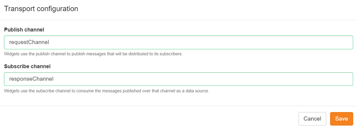
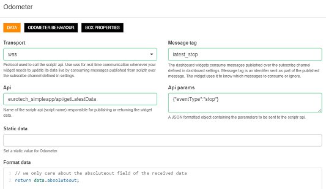

# Understanding the application's code

This section describes in details the code of the application. Since the code itself is commented it should be self explanatory. Therefore, you can skip reading this document and get back to it in case you need clarifications.

- [Structure of the application](./understanding_the_code.md#structure-of-the-application)
- [Ingesting the device messages (events)](./understanding_the_code.md#ingesting-the-device-messages-events)
- [Persisting the events](./understanding_the_code.md#persisting-the-events)
- [Reading the persisted events](./understanding_the_code.md#reading-the-persisted-events)
- [Publishing updates to the dashboard](./understanding_the_code.md#publishing-updates-to-the-dashboard)
- [Displaying data in the dashboard](./understanding_the_code.md#displaying-data-in-the-dashboard)

[<< back](./running_the_application.md)

## Structure of the application

The application is composed of three layers:

- /view: it contains the dashboard script. The dashboard invokes the scripts in the /api layer
- /api: it defines a simple API layer on top of the - simple - logic of the application and contains 3 simple scripts that implement API operation (getLatestData, getHistoricalData and inject)
- /entities: it contains scripts that implement the logic of the application. 

[back](./understanding_the_code.md#understanding-the-applications-code)

## Ingesting the device messages (events)

The **/api/inject** script automatically receives the mqtt messages that are published by the devices and broadcast by Everyware:

- the mqtt message is received in the rawBody property of the native **request** object and it is parsed into a JSON object
```
var message = JSON.parse(request.rawBody);
```
- the script then extracts the device id from the name of the topic to which the message was published (this name is provided in the mqtt message)
```
var msgParts = message.topic.split("/");
var data = {
   
   deviceId: msgParts[1],
   payload: message.payload
}; 

```
- the message payload is then transformed into a flat key/value pairs structure. Note that a device can publish two types of messages:   
  - one type is related to the bus speed and its position (speed, latitude, longitude) 
  - the other type is related to the number of passengers gettings of/on the bus and its positon (absolutein, absoluteout, absoluteopop, latitude, longitude)
```
var event = {
   id: data.deviceId
};
   
if (data.payload.position.speed) {    
   event.speed = data.payload.position.speed;
}
    
if (data.payload.position.latitude) {
        
   event.lat = Number(data.payload.position.latitude).toFixed(4);
   event.long = Number(data.payload.position.longitude).toFixed(4);
}

for (var i = 0; data.payload.metric && i < data.payload.metric.length; i++) {
   event[data.payload.metric[i].name.toLowerCase()] = data.payload.metric[i].int_value // this code assumes all values are of type int
}
```
- once this data structure is ready, the inject script hands it over to the saveData() function defined in the **datamanager** script
```
var dataManager = require("../entities/datamanager");
return dataManager.saveData(event);
```
[back](./understanding_the_code.md#understanding-the-applications-code)

## Persisting the events

The **/entities/datamanager** script deals with the CRUD operation executed on the data that are received from the devices. More particularily, the **saveData(event)** method persists it into scriptr's NoSQL data store.

- First thing the saveData() does is to add the "type" field that will be used to determine the type of event that is received. If the latter contains speed, lat and long data, we set the type to "moving". Otherwise (we received passengers metrics and position) we set the value of type to "stop"
```
event.type = event.speed ? "moving" : "stop";  
```
- The function then creates some metadata that is used to inform scriptr about the types of values it has to store. This is not a mandatory step as scriptr will turn every value to a string by default. Adding metadata is howwever useful if we need to run some type-specific operations, such as asking scriptr to calculate the average speed, as we wil see it later on:
```
event["meta.types"] = {

  "speed": "numeric",
  "lat": "numeric",
  "long": "numeric",
  "absolutein": "numeric",
  "absoluteout": "numeric",
  "absolutepop": "numeric"
};

```
- to persist the data, the saveData() function only needs to require scriptr's native **document module** and invoke it's **create()** function, passing it the event + metadata:
```
var documentModule = require("document");
var resp = document.create(event);
```

[back](./understanding_the_code.md#understanding-the-applications-code)

## Reading the persisted events

Our applications' dashboard has to display the historical and latest events values, as well as the average speed of the bus. Querying the persisted events to provide the latter is done by 3 functions defined in the **/entities/datamanager** script

### Reading historical event values

This is the job of the **listHistoricalData(deviceId, pageNumber, resultsPerPage, eventType)** function. It is a generic function that retrieves the events of a given type (i.e "moving" or "stop" as described earlier), for a given device id. If the latter is not provided, it reads the events of the provided type, for all devices.

- first thing the function does it to prepare the query that will be executed agains scriptr's data store. The query has to specify:
  - the fields to return. In our case, we instruct scriptr to return all fields  --> '*'
  - the number (index) of the page to return (scriptr automatically paginates the results if their total number is > 50)
  - the max number of results to return per page (this number has to be <= 50, which is the default value)
  - the count field to instruct scriptr to return the total count of results
  - most importantly, the query expression, which a string that defines the filtering criteria to query the events. In our case, we will be filtering by event type and - if available - device id, e.g. 'type="moving" and id="scriptr-bus-002"
```
var queryParams = {        

     fields: "*",
     query: 'type="' + (eventType ? eventType :  "moving") + '"',
     count: true
 };

 if (deviceId){
     queryParams.query = 'deviceId="' + deviceId + '"';
 }

 if (pageNumber) {
     queryParams.pageNumber = pageNumber;
 }

 if (resultsPerPage) {
     queryParams.resultsPerPage = resultsPerPage;
 }
```
- next thing is to execute our query by passing the above to the  query() function of the native **document** module, required ealier in the script
```
var resp = document.query(queryParams); 
return resp.result.documents;
```

### Reading latest event values

The **getLatestData(deviceId, eventType)** is in charge of returning the latest event data of a given event type for a givend device id. If the device id is not provided, it just returns the latest event of the specified event type. 

By default, queries in scriptr always retun a list of record sorted by descending creation date. Therefore, we can reuse the listHistoricalData() function and only return the first item on the list.
```
var latestData = listHistoricalData(deviceId, 1, 1, eventType)[0];
```

### Calculating the average speed

Scriptr's simple yet powerful querying mechanism allows you to execute aggregates functions on your data (min, max, sum, average, etc.). We leverage this ability in the **getAverageSpeed(deviceId)** function.

- first, we defined the query parameters by specifying:
  - the fields to return, in our case, we're only interested in "speed"
  - the aggregate expression, i.e. the aggregate function to apply. In our case, it is the average function applied to speed
  - the aggregare scope, i.e. specify if the aggregation should apply on all the recorded events or only on a page by page basis
  - the query expression, i.e. the filter. In our case, we only need to consider the events that contain speed, i.e. those of type 
  "moving", for a given device id when the latter is provided.
 ```
 var queryParams = {

     query: 'type="moving"',
     fields: "speed",
     aggregateExpression: "avg($speed)",
     aggregateGlobal: true
 };

 if (deviceId) {
     queryParams.query = queryParams.query + ' and deviceId="' + deviceId + '"';
 }
 ```
- next, we execute the query by passing the above parameters to the query() function of the native **document** module.
```
var resp = document.query(queryParams);
return resp.result.aggregate.globalScope.value;
```

[back](./understanding_the_code.md#understanding-the-applications-code)

## Publishing updates to the dashboard

As we will see it in the next paragraphs, our dashboard subscribes to the **responseChannel** that [we created when installing the application](./installing_the_application.md#create-channels), to consume any messages that are published to the channel. This ability allows us to broadcast data in real time to the dashboard, by publishing any update to the corresponding channel.

We use the native **publish(channelName, message)** method to publish to scriptr channels, by specifying the name of the channel to publish to and the message (any data structure) to publish. When publishing to a scriptr dashboard, the message should adopt the following predefined data structure: ```{id: filter_name, result: some_appropriate_data}```:
- the id field is used to target a specific widget (or group of widgets) of the dashboard
- the result field contains data in the format that is expected by the targeted widget

In the **/entities/datamanger** script, three functions are in charge of publishing updates to the dashboard:

- publishUpdatesMovingType(): publishes events of type "moving" in addition to the average speed. As you can see, it sets the message id to "latest_moving". which means that only widgets listening to this id will consume the message
```
event.averageSpeed = getAverageSpeed(event.deviceId);
var resp = publish("responseChannel", {id: "latest_moving", result: event});
```
- publishUpdatesStopType(): publishes events of type "stop". The function actually performs to publish() calls, one of them containing data specifically formatted to be used by the map widget of the dashboard. This time, we have used a different message id (latest_stop), to only target the widgets that are interested in this id
```
var resp = publish("responseChannel", {id: "latest_stop", result: event});
resp = publish("responseChannel", {id: "latest_map", result: util.formatData(event)});
```
- publishUpdatedHistorical() publishes historical event values to the channel
```
var resp = publish("responseChannel", {id: "latest_historical", result: data});
```
[back](./understanding_the_code.md#understanding-the-applications-code)

## Displaying data in the dashboard

In the [workspace](https://www.scriptr.io/workspace), expand the code tree in the left pane and double click on **/view/dashboard** to open the dashboard designed for the application. The dashboard is composed of the following widgets:
- 1 map, that displays the current and former position of the bus
- 3 odometers, respectively displaying the last number of passengers hot got on the bus, the last number of passengers who got of the bus and the current number of passengers on the bus
- 2 speedometers, respectively showing the current bus speed and current average speed of the bus
- A line chart, displaying the variation of passenges who got on/off the bus and those who are on the bus

### Displaying data in real time

*Note: your dashboard should be pre-configured so the below is for your information*

To allow a dashboard to display data in real time, we  need to subscribe it to a scriptr channel, in our case, to **responseChannel** since this is where the **/entities/datamanger** is publishing updates, as described above. 

To subscribe the dashboard to the channel, click on the gear icon in the top right corner of the dashboard. In the "Subscribe channel"  field, type "responseChannel". You do not have to fill the "Publish channel" field. Click "Save" to validate you changes.



*Image 1 - Subscribe the dashboard to the responseChannel*

Next step is to specify in every widget the identifier of the message it is interested in. The procedure is identical for all the widgets so we will use "Out" odometer as an example (it display the number of passengers who got off the bus):

- Open the widget's settings by cliking on the gear icon in its top right corner
- Select **wss** (secure websockets) for the **Transport** field
- In the **Message tag** field, type **latest_stop**, which is the message id that contains interest data for the odometer
- In the **Format data** field, type **return data.absoluteout** to instruct the widget to display the value of the absoluteout field of the data it received
- click **Save** to validate. Don' t forget to also save the changes in the dashboard (by clicking Save in the toolbar)



*Image 2 - Configure a widget to read data*

In the table below, we map every widget to the message id it should listen to, as well as to the format data instruction used to filter the data

| widget | message tag | format data intruction |
|--------|-------------|------------------------|
| In odometer | latest_stop | return data.absolutein; |
| pop odometer | latest_stop | return data.absolutein; |
| Current speed odometer | latest_moving | return data.speed; |
| Average speed odometer | latest_moving | return data.averageSpeed; |
| Historical data line chart | latest_historical | return data; |
| Map | latest_map | return data;|

*Table 1 - Associating widgets to message tags and data filters*

### Displaying data the first time the dashboard is loaded

While our dashboard displays data in real time (as device messages flow in), it won't display anything the first time it is loaded if no message arrives simultaneously. Therefore, to avoid displaying an empty dashboard, we should configure the widget to read the latest data that was received and persisted. This is simply done by setting the value of the **Api** field in the widget's settings, to the name of a script that can return the required data. The first time the dashboard is loaded, each widget will automatically invoke the specified API operation and display the returned value.

In our application, the API scripts are contained in the /api folder. The below table associates each widget to the name of the API script it needs. Observe that to optimize our script (avoid writting the same logic multiple times) our API scripts are parameterizable. For example, if we pass the **eventType=moving** parameter to the **/api/getLatestData** API script, it only returns the latest event of type "moving". Same goes for **eventType=stop**. In the widgets settings, this parameter is passed using the **Api params** field. Note that in the case of the map widget, we also need to pass the **format=true** parameter, to ask our scripts to format the data in a way it can be displayed in a map.

| widget | API script  | Parameter|
|--------|-------------|----------|
| Out odometer | eurotech_simpleapp/api/getLatestData | {"eventType":"stop"} |
| In odometer | eurotech_simpleapp/api/getLatestData | {"eventType":"stop"} |
| pop odometer | latest_stop | eurotech_simpleapp/api/getLatestData | {"eventType":"stop"} |
| Current speed odometer | eurotech_simpleapp/api/getLatestData | {"eventType":"moving"} |
| Average speed odometer | eurotech_simpleapp/api/getLatestData | {"eventType":"moving"} |
| Historical data line chart | eurotech_simpleapp/api/listHistoricalData } | {"eventType":"stop"} |
| Map | latest_map | eurotech_simpleapp/api/getLatestData | {"eventType":"moving", "formatData":"true"} |

*Table 2 - Associating widgets to message API operations and operation parameters*

[back](./understanding_the_code.md#understanding-the-applications-code)

